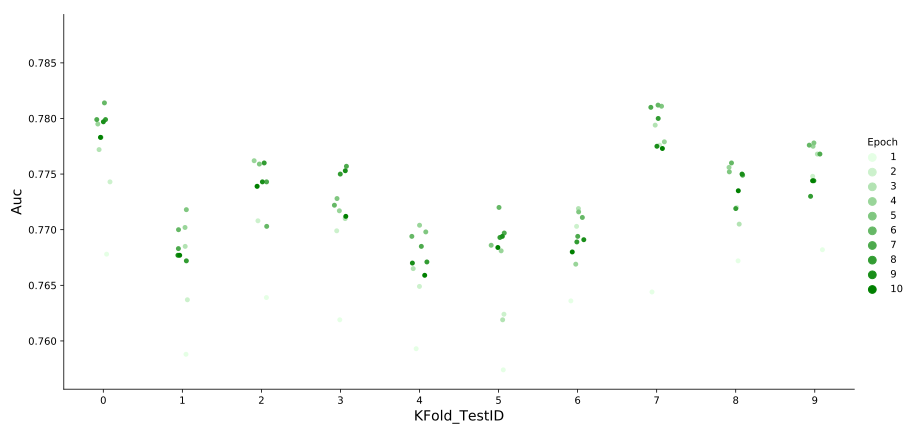
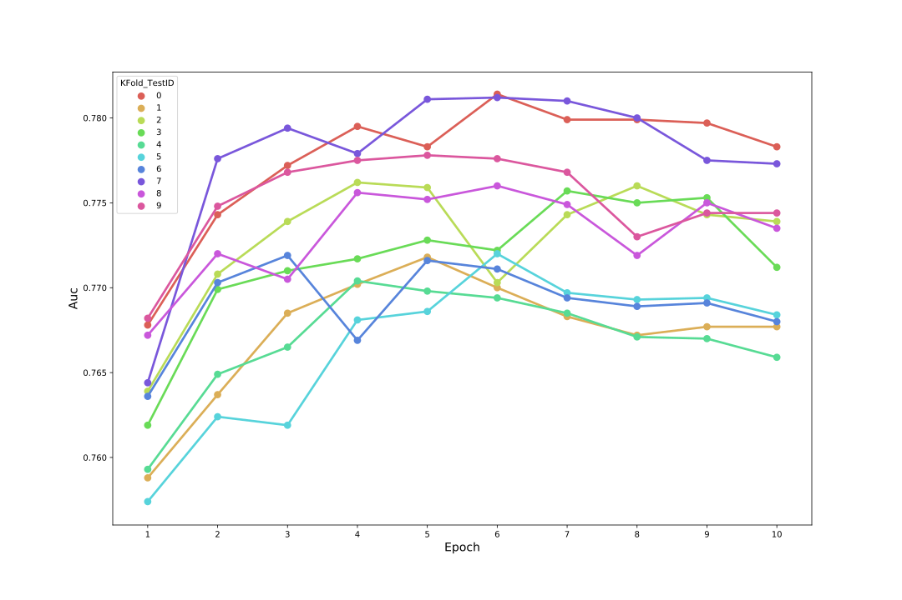

<center></center>

<br/>

<center></center>

<br/><br/><br/><br/>

<center style="font-size:2.5rem;font-weight:bold">《量化投资》课程作业</center><br/><br/>
<center style="font-size:1.9rem;font-weight:bold">基于大数据的多因子量化风险控制模型</center><br/><br/>
<center style="font-size:1.5rem"><b>作者</b>：<u>&ensp;陈希尧&ensp;3180103012&ensp;</u></center><br/>
<center style="font-size:1.5rem"><strong>日期</strong>：<u>&ensp;2022年1月&ensp;</u></center>

<div STYLE="page-break-after: always;"></div>

<br/><center><font size = "5" color = "0x333333">目录</font></center><br/><br/>

[TOC]

---

# 摘要

## 研究背景

智能风控作为一门新兴的技术，其基本逻辑主要是通过大数据平台的计算分析能力、机器学习或深度学习模型，运用于信贷风控、反欺诈、反洗钱、交易监控、保险理赔等场景。本质上来说，智能风控是以数据驱动的风险管控与运营优化技术。

对于金融机构而言，智能风控并没有改变底层业务逻辑，也和传统金融的风控模式、建模方法和原理没有本质区别。只是由于大数据的引入，能够获取到更多维度的外部数据，像客户行为、电商消费、运营商数据、地理位置、购物习惯等等。与传统金融数据相比(如央行征信、交易流水、资产状况、财务报表等)，虽然这些数据与客户违约本质上没有必然关系，但增加了更多风险因子和变量，可以从更多层面刻画客户风险视图，提升风险定价、违约计算的效果。

以消费信贷风控为例，按照贷前、贷中、贷后作为风控的时间维度，以信用品质、偿债能力、押品价值、财务状况、还款条件作为评估维度，时间和评估形成不同的信贷风险关注要点。商业银行结合不同信贷风险的关注要点，进行相关数据的获取。无论是对个人或是企业的银行贷款、抵质押或担保贷款，亦或是供应链贷款、评分卡、巴塞尔协议中的贷款，还是当前热门的智能风控，根本原理都是衡量客户还款能力和意愿。智能风控通过更多的数据维度来刻画客户特征，从而更准确的量化客户违约成本，实现对客户的合理授信。

## 研究意义

消费信贷作为一般人接触最频繁的金融工具，其风控必然成为金融监管之中的重中之重。因此，通过深度学习模型更加准确地预测客户是否违约，能够为相应的金融风控带来质的飞跃。同时，相应的消费信贷模型可以迁移学习至其他的客户风险预测模型中，为金融风控带来更加准确的预测效果。

在本次实验中，我将探究智能风控技术中不同数据处理方式以及不同模型所带来的不同结果。同时，本实验将通过**Home Credit Default Risk**数据集，探究智能风控技术在消费信贷风控的最终预测成果，特别是深度学习模型在该领域的表现。

此次研究能够帮助我更深入地了解风控数据特征背后所代表的本质，引导我更有针对性地改进相应的模型与算法。在此基础上，我也能够了解到不同模型所带来的不同效果，同时，我将通过深度学习模型与传统的信贷风控模型进行相应的对比，更好地理解智能风控技术的内涵。

# 国内外研究现状与存在问题

## 国内外研究现状

美国作为最早孕育金融风控技术的国家，其信贷风控技术已经成熟运用于各个金融领域。由Fair Isaac公司开发的FICO信用评分系统，已经作为美国应用得最广泛的一种风控技术。FICO评分系统得出的信用分数范围在300～850分之间，分数越高，说明客户的信用风险越小，它采集客户的人口统计学信息、历史贷款还款信息、历史金融交易信息、银行征信信息等，通过逻辑回归模型计算客户的还款能力，预测客户在未来一年违约的概率。

然而，并非所有个人客户都能提供出完备而准确的信息。当变量有缺失的时候, FICO模型给出的分数就不准确。

因此，美国的互联网金融公司ZestFinance从2009年就开始研发基于大数据的信用评估模型：融合多源信息，采用机器学习的预测模型和集成学习策略，进行大数据挖掘。他们收集了上千种来源于第三方的数据，比如水、电、煤账单，电话账单，房屋租赁信息，和传统的金融借贷、还款信息等;通过机器学习的方法寻找数据间的关联性并对数据进行必要的转换;在关联性的基础上将数据重新整合成不同的测量指标;每一种指标反映个体的某一方面特征，比如诈骗概率、长期和短期的信用风险和偿还能力;最后，将所有指标按加权投票的原则，做成最终的信用评分。

同时，国内阿里巴巴采用大数据技术推出的芝麻信用评分模型，其不同于传统的逻辑回归模型，采用的是基于大数据分析技术的机器集成学习法Ensentole，采集了上万个数据项,包括传统的金融类交易数据、还款数据以及从移动互联网络和社交网络得到的第三方非金融行为数据等,从还款能力、还款意愿、稳定性、欺诈可能性等不同层面进行建模打分,再把单个层面的评分结合个体信息,综合给个体一个最终的信用评分。

## 存在问题

现存的智能风控系统仍然难以称之为“智能”。从一系列的工作中我可以看到，目前大部分智能风控系统仍是基于规则组合、条件筛选来实现风险预警，仍通过半自动化的方式来辅助人来判断是否存在风险。

同时，我也应该看到，金融风控模型仍然存在着较多的系统性问题，包括过拟合，模型衰减等难以根除的问题。以模型衰减为例，商业活动中已经通过一系列大数据形成了一些相对较为稳定的模型算法，不少是根据历史数据或通过人工学习大量样本的方式得来的。不过，现实中很多变量关系只是在一些特定阶段在特定的条件下存在，一旦其中一些因素消失了，很可能原先应用较好的一些模型相关性将不复存在。风控模型也会出现模型假设前提条件改变，数据之间逻辑关系消失，模型表现随着时间推移衰减。

更重要的是，一般的智能风控技术主要通过大量的风控数据和固化的风控逻辑进行程式化的预测，这导致了传统的以LightGBM、XGBoost为主的智能风控技术存在难以泛化的问题。对于不同的风控应用场景，我无法迁移其他场景的风控模型至所需模型的场景，此类专门化的智能风控技术缺乏相应的动态化与普适性。更近一步，如果数据在进一步地发生变化，一般的智能风控技术训练模型难以再次调整模型算法，给出的预测结论也存在着较大的问题。

# 研究目标与研究内容

## 研究目标

在智能金融风控模型实现的基础上，我将实现以LightGBM为核心的机器学习风控模型以及以DNN为核心的深度学习风控模型，并导入**Home Credit Default Risk**数据集进行相应的模型训练，最终比较两大不同训练框架下的模型的训练结果，并进行相应的评价与判断。

## 研究内容

- 完成以LightGBM为核心的机器学习风控模型框架搭建
- 完成以DNN为核心的深度学习风控模型框架搭建
- 对数据进行相应的可视化分析
- 对数据进行相应的特征工程预处理
- 训练相应的模型得出预测结论
- 比较两个不同模型，进行相应的评价与判断

# 数据说明

本项目采用的数据来自大数据竞赛平台[Kaggle](https://www.kaggle.com)的[Home Credit Default Risk](https://www.kaggle.com/c/home-credit-default-risk)数据集，这是一个比较经典的用于构建因子模型的数据集。

# 因子分析思路与实验原理

## 特征工程

### One-Hot 编码

我对**Home Credit Default Risk**数据集的数据进行了相应的可视化分析，观察到较多的离散型特征，因此需要对大多数的类别进行一系列的转换，使其成为机器学习算法中容易处理的一种形式。而One-hot编码便成为了我的首选特征工程。

- **简介**

  One-hot用来表示一种特殊的向量，在这个任意维度的向量中，仅有一个维度的值是1，其余为0。譬如向量$[0\ 0\ 0\ 0\ 0\ 1\ 0\ 0\ 0\ 0\ 0\ 0\ 0\ 0\ 0]$，即为15维空间中的一个one-hot向量。将属性类的特征转换成one-hot向量的过程则称one-hot编码。

  使用one-hot编码，将离散特征的取值扩展到了欧式空间，离散特征的某个取值就对应欧式空间的某个点。之所以要这么做是因为在回归、分类、聚类等机器学习算法中，特征之间距离的计算或相似度的计算是非常重要的，而我常用的距离或相似度的计算都是在欧式空间的相似度计算。

  One-hot的优缺点如下：

  - 优点：独热编码解决了分类器不好处理属性数据的问题，在一定程度上也起到了扩充特征的作用。它的值只有0和1，不同的类型存储在垂直的空间。

  - 缺点：当类别的数量很多时，特征空间会变得非常大，成为一个高维稀疏矩阵。在这种情况下，一般可以用PCA来减少维度。而且one hot encoding+PCA这种组合在实际中也非常有用。

- **应用场景**

  对于某些离散的特征，使用独热码能够使不同特征之间的分布更为合理。例如对于离散型特征`Color = {Red, Green, Blue}`，使用一般的编码来表示这个特征，则可以`Color = {Red = 0, Green = 1, Blue = 2}`。两个颜色之间的距离为`(Red, Green) = 1, (Red, Blue) = 2, (Green, Blue) = 1`，这样来看似乎`Red`和`Blue`的相似性会逊于其他组合，但实际上并没有这种关系，显然这样的表示计算出来的特征距离是不合理。如果使用one-hot编码，则可以将`Color`表示为`{Red = (1, 0, 0), Green = (0, 1, 0), Blue = (0, 0, 1)}`，那么任意两个`Color`特征之间的欧式距离都是$\sqrt{2}$，这样相等的特征距离显然会更为合理。

  但是one-hot也并不是适用于所有的离散特征的，如果特征是离散的，并且不用one-hot编码就可以很合理的计算出距离，那么就没必要进行one-hot编码，例如对于以label编码表示的军官军衔特征`Officers = {Captain = 0, Major = 1, Colonel = 2, General = 3}`，不同特征之间的距离表示的就是军级之差，而如果用one-hot进行表示反而会使其失去意义。

- **实现**

  调用pandas的`get_dummies()`方法进行one-hot编码，这个方法的doc如下：

  ```
  Help on function get_dummies in module pandas.core.reshape.reshape:
  get_dummies(data, prefix=None, prefix_sep='_', dummy_na=False, columns=None, sparse=False, drop_first=False, dtype=None) -> 'DataFrame'
      Convert categorical variable into dummy/indicator variables.
  ```

  封装的函数如下：

  ```python
  def one_hot_encoder(df, nan_as_category = True):
      original_columns = list(df.columns)
      categorical_columns = [col for col in df.columns if df[col].dtype == 'object']
      df = pd.get_dummies(df, columns= categorical_columns, dummy_na= nan_as_category)
      new_columns = [c for c in df.columns if c not in original_columns]
      return df, new_columns
  ```

### GaussRank 连续特征预处理

在对DNN模型进行基础的数据测试时，我惊讶地发现一般的`Standardization` 或 `normalization`特征工程在模型中的表现欠佳，与未进行处理的基础数据结果相差无几。针对这一现象，我查阅了相关资料，最终选择了GaussRank方法来处理DNN模型中的数据。

- **简介**

  对于基于梯度的模型（如本实验中的DNN模型），其输入的规范化非常重要。GaussRank作为一种类规范化的特征工程，对于DNN等多梯度实现的模型有着较大的提升作用。GaussRank首次被运用于**Porto Segro’s Safe Driver Prediction** 的预测模型中，获得了比一般化的`normalization`更好的效果。同时One-hot编码可以直接运用于GaussRank处理之上，使得数据处理更为方便。

  GaussRank处理数据主要基于不同的等级转换。其主要的实现原理如下：

  - 计算给定列（使用`argsort`）中每个值的等级。再利用归一化将等级为-1...1

  - 使用`linspace`存储从-1...1的已经排序的特征，再将其导入误差函数 `ErfInv`的逆函数中，得到相应的高斯分布函数，最后减去相应的平均值

- **原理**

  由于深度神经网络涉及到很多层的叠加，而每一层的参数更新会导致上层的输入数据分布发生变化，通过层层叠加，高层的输入分布变化会非常剧烈，这就使得高层需要不断去重新适应底层的参数更新。而一般化的`Standardization` 或 `normalization`特征工程会在多层神经网络的运算中产生一系列的梯度爆炸或梯度消散现象，导致最终的模型难以收敛，效果欠佳。

  而GaussRank则将进行等级排列后形成的秩进行高斯分布排列，这种数据的分布极大地减弱了高层次的神经网络的波动性，减少了一定程度的梯度爆炸或梯度消散现象，使得相应的模型结果更为出色。

  但仍要看到的是，GaussRank有其本身的局限性：

  - 数据处理较为复杂和低效，需要保存整个数据列的相应高斯分布
  - 难以处理`low-cardinality`的特征，由几率使得相同的特征得到不同的值

- **实现**

  调用scipy库中的erfinv函数进行GaussRank 实现

  ```python
  def rank_gauss(x):
      from scipy.special import erfinv
      N = x.shape[0]
      temp = x.argsort()
      rank_x = temp.argsort() / N
      rank_x -= rank_x.mean()
      rank_x *= 2
      efi_x = erfinv(rank_x)
      efi_x -= efi_x.mean()
      return efi_x
  ```

## LightBGM 模型

LightGBM（Light Gradient Boosting Machine）是一个实现GBDT算法的框架，支持高效率的并行训练，并且具有更快的训练速度、更低的内存消耗、更好的准确率、支持分布式可以快速处理海量数据等优点。

为了解决XGBoost模型空间消耗大，时间开销大以及对cache优化不友好的缺陷，LightGBM应运而生。LightGBM在传统的GBDT算法上进行了如下优化：

1. 基于Histogram的决策树算法
2. 单边梯度采样 Gradient-based One-Side Sampling(GOSS)：使用GOSS可以减少大量只具有小梯度的数据实例，这样在计算信息增益的时候只利用剩下的具有高梯度的数据就可以了，相比XGBoost遍历所有特征值节省了不少时间和空间上的开销
3. 互斥特征捆绑 Exclusive Feature Bundling(EFB)：使用EFB可以将许多互斥的特征绑定为一个特征，这样达到了降维的目的
4. 带深度限制的Leaf-wise的叶子生长策略：大多数GBDT工具使用低效的按层生长 (level-wise) 的决策树生长策略，因为它不加区分的对待同一层的叶子，带来了很多没必要的开销。实际上很多叶子的分裂增益较低，没必要进行搜索和分裂。LightGBM使用了带有深度限制的按叶子生长 (leaf-wise) 算法

- **基于Histogram的决策树算法**

  Histogram algorithm应该翻译为直方图算法，直方图算法的基本思想是：先把连续的浮点特征值离散化成$k$个整数，同时构造一个宽度为$k$的直方图。在遍历数据的时候，根据离散化后的值作为索引在直方图中累积统计量，当遍历一次数据后，直方图累积了需要的统计量，然后根据直方图的离散值，遍历寻找最优的分割点。

  

  直方图算法简单理解为：首先确定对于每一个特征需要多少个箱子（bin）并为每一个箱子分配一个整数；然后将浮点数的范围均分成若干区间，区间个数与箱子个数相等，将属于该箱子的样本数据更新为箱子的值；最后用直方图表示。

- **单边梯度采样算法**

  单边梯度采样算法算法(Gradient-based One-Side Sampling)从减少样本的角度出发，排除大部分小梯度的样本，仅用剩下的样本计算信息增益，它是一种在减少数据量和保证精度上平衡的算法。

  GOSS是一个样本的采样算法，目的是丢弃一些对计算信息增益没有帮助的样本留下有帮助的。根据计算信息增益的定义，梯度大的样本对信息增益有更大的影响。因此，GOSS在进行数据采样的时候只保留了梯度较大的数据，但是如果直接将所有梯度较小的数据都丢弃掉势必会影响数据的总体分布。所以，GOSS首先将要进行分裂的特征的所有取值按照绝对值大小降序排序（XGBoost一样也进行了排序，但是LightGBM不用保存排序后的结果），选取绝对值最大的$a*100\%$个数据。然后在剩下的较小梯度数据中随机选择$b*100\%$个数据。接着将这$b*100\%$个数据乘以一个常数$\frac{1-a}{b}$，这样算法就会更关注训练不足的样本，而不会过多改变原数据集的分布。最后使用这 个数据来计算信息增益。下图是GOSS的具体算法:
  
  

- **互斥特征捆绑算法**

  高维度的数据往往是稀疏的，这种稀疏性启发我设计一种无损的方法来减少特征的维度。通常被捆绑的特征都是互斥的（即特征不会同时为非零值，像one-hot），这样两个特征捆绑起来才不会丢失信息。如果两个特征并不是完全互斥（部分情况下两个特征都是非零值），可以用一个指标对特征不互斥程度进行衡量，称之为冲突比率，当这个值较小时，我可以选择把不完全互斥的两个特征捆绑，而不影响最后的精度。互斥特征捆绑算法（Exclusive Feature Bundling, EFB）指出如果将一些特征进行融合绑定，则可以降低特征数量。这样在构建直方图时的时间复杂度从$O(data*feature)$变为$O(data*bundle)$，这里$bundle$指特征融合绑定后特征包的个数，且$bundle$远小于$feature$。

  - **解决哪些特征应该绑在一起**

    LightGBM的EFB算法将这个问题转化为图着色的问题来求解，将所有的特征视为图的各个顶点，将不是相互独立的特征用一条边连接起来，边的权重就是两个相连接的特征的总冲突值，这样需要绑定的特征就是在图着色问题中要涂上同一种颜色的那些点（特征）

    EFB 算法的伪代码如下所示:

    

  - **解决怎么把特征绑为一捆**

    特征合并算法，其关键在于原始特征能从合并的特征中分离出来。绑定几个特征在同一个bundle里需要保证绑定前的原始特征的值可以在bundle中识别，考虑到histogram-based算法将连续的值保存为离散的bins，我可以使得不同特征的值分到bundle中的不同bin（箱子）中，这可以通过在特征值中加一个偏置常量来解决。

    伪算法如下所示：

    

- **带深度限制的 Leaf-wise 算法**

  LightGBM采用Leaf-wise的增长策略，该策略每次从当前所有叶子中，找到分裂增益最大的一个叶子，然后分裂，如此循环。因此同Level-wise相比，Leaf-wise的优点是：在分裂次数相同的情况下，Leaf-wise可以降低更多的误差，得到更好的精度；Leaf-wise的缺点是：可能会长出比较深的决策树，产生过拟合。因此LightGBM会在Leaf-wise之上增加了一个最大深度的限制，在保证高效率的同时防止过拟合。

  

## DNN 模型

深度神经网络（Deep Neural Networks）是深度学习的基础，在该实验中，我将实现一个五层Layer的DNN模型。

- **从感知机到神经网络**

  感知机是一个有若干输入和一个输出的模型，其模型如下：

  

  输出和输入之间学习到一个线性关系，得到中间输出结果为：$z=\sum\limits_{i=1}^mw_ix_i + b$，同时感知机也包含了一个神经元激活函数$sign(z)$，较为常见的有$sign(z)= \begin{cases} -1& {z<0}\\ 1& {z\geq 0} \end{cases}$

  而神经网络则在感知机的模型上做了扩展：

  - 加入了隐藏层，隐藏层可以有多层，增强模型的表达能力，如下图所示

  

  - 输出层的神经元可以不止一个输出，可以有多个输出，这样模型可以灵活的应用于分类回归，以及其他的机器学习领域比如降维和聚类等。

  

  - 对激活函数做扩展。感知机的激活函数是$sign(z)$,虽然简单但是处理能力有限，因此神经网络中一般使用的其他的激活函数，比如我在逻辑回归里面使用过的Sigmoid函数。

- **DNN的基本结构**

  从DNN按不同层的位置划分，DNN内部的神经网络层可以分为三类，输入层，隐藏层和输出层,如下图示例，一般而言，第一层是输入层，最后一层是输出层，而中间的层数都是隐藏层。

  

  层与层之间是全连接的，也就是说，第$i$层的任意一个神经元一定与第$i+1$层的任意一个神经元相连。虽然DNN看起来很复杂，但是从小的局部模型来说，还是和感知机一样，即一个线性关系$z=\sum\limits w_ix_i + b$加上一个激活函数$σ(z)$。

- **DNN前向传播算法**

  利用和感知机一样的思路，我可以利用上一层的输出计算下一层的输出，也就是所谓的DNN前向传播算法。

  

  对于第二层的的输出$a_1^2,a_2^2,a_3^2$，我有：

$$
a_1^2=\sigma(z_1^2) = \sigma(w_{11}^2x_1 + w_{12}^2x_2 + w_{13}^2x_3 + b_1^{2})
$$

$$
a_2^2=\sigma(z_2^2) = \sigma(w_{21}^2x_1 + w_{22}^2x_2 + w_{23}^2x_3 + b_2^{2})
$$

$$
a_3^2=\sigma(z_3^2) = \sigma(w_{31}^2x_1 + w_{32}^2x_2 + w_{33}^2x_3 + b_3^{2})
$$

​		对于第三层的的输出$a_1^3$，我有
$$
a_1^3=\sigma(z_1^3) = \sigma(w_{11}^3a_1^2 + w_{12}^3a_2^2 + w_{13}^3a_3^2 + b_1^{3})
$$
​		将上面例子一般化，假设第$l-1$层共有m个神经元，则对于第$l$层的第j个神经元的输出$a_j^l$，我有：
$$
a_j^l = \sigma(z_j^l) = \sigma(\sum\limits_{k=1}^mw_{jk}^la_k^{l-1} + b_j^l)
$$
　　其中，如果$l=2$，则对于的$a_k^1$即为输入层的$x_k$。

　　从上面可以看出，使用代数法一个个的表示输出比较复杂，而如果使用矩阵法则比较的简洁。假设第$l-1$层共有m个神经元，而第$l$层共有n个神经元，则第$l$层的线性系数$w$组成了一个$n×m$的矩阵$W^l$, 第$l$层的偏倚$b$组成了一个$n×1$的向量$b^l$ , 第$l−1$层的的输出$a$组成了一个$m×1$的向量$a^{l−1}$，第$l$层的的未激活前线性输出$z$组成了一个$n×1$的向量$z^l$, 第$l$层的的输出$a$组成了一个$n×1$的向量$a^l$。则用矩阵法表示，第$l$层的输出为：
$$
a^l = \sigma(z^l) = \sigma(W^la^{l-1} + b^l)
$$

# 因子可视化分析

- #### **贷款是否还清**

  

  从上述数据结果中我看到，高到91.9%的贷款最终都顺利还清，但仍有8.07%的债务成为了坏账

- #### 客户家庭状况

  

  从上图我可以看到，许多客户都是已婚人士，紧随其后的则是单身人士以及`Civil marriage`家庭。但在未归还贷款的比例上，`Civil marriage`家庭拥有最高的归还比例，而遗孀家庭归还的比例最小

- #### 客户受教育状况

  

  

  显而易见，需要该贷款的人士大多数学历处于中学水平，24%的人受过更高层次的教育。同时，我在第二项客户受教育状况对贷款是否还清的统计中也发现，中学水平的顾客有着较低水平的还款率，受教育状况对顾客是否还清贷款有着较为重要的参考指标性能

- #### **客户职业**

  

  

  客户职业主要以工人、营业员、经理、司机为主。而从第二项不同职业的还款率上看，工人、营业员、司机等申请贷款人数较多的职业还款率也较低，但经理职业是个例外。

- #### 客户收入来源

  

  

  贷款申请人以工作收入居多，其次的收入来源为商业助理、退休人员和公务员。同时，我从另一项数据分析中得到，产假（`Maternity leave`）申请者有近40%的不归还贷款，其次是失业者（37%）。其他类型的收入由于不归还贷款而低于平均10%。

# 项目构建

## 项目设计说明

本实验将分为两大模块进行，第一大模块是对LightGBM模型的实现，第二大模块则是对DNN模型的实现。

在对LightGBM模型的实现中，我首先将使用One-hot等特征工程进行数据预处理，再调用LightGBM中的分类器，实现相应的LightGBM模型，进行数据的预测。

在对DNN模型的实现中，除了运用一些与LightGBM模型类似的特征工程外，我将使用GaussRank等专门针对DNN模型的神经网络数据预处理特征工程，然后我将搭建五层以`PReLU`作为激活函数的DNN模型，进行相应的实验。

## 项目实现

针对两个模型各自不同的特点，我使用的预处理方式也不同

### LGBM实现

#### 预处理

对于各个表格，首先进行以下通用的数据处理：

1. 将所有字符串类型的特征用`LabelEncoder`方法进行one-hot编码
2. 将`SK_ID_CURR`（样本中贷款ID，其中bureau.csv样本中一笔贷款可以有一至多笔在信用局相关的信贷记录`SK_ID_BUREAU`）特征重复的数据全部用平均值、最小值、最小值（针对数值数据）、高频值（针对字符串）等方式进行去重
3. 将类型为`object`（如`pd.ndarray`）的列的数据转化为其在不同的`SK_ID_CURR`对应的数据中出现的次数（调用`nunique()`方法实现）

针对bureau表，由于其一对多（当前一个贷款对应多个贷款记录）的特殊性以及其对预测的重要性，还需要进行以下处理：

1. 将`MONTHS_BALANCE`（相对于申请月的月份，非正整数）相同（即同一个申请月份）的数据合并
2. 将`AMT_CREDIT_MAX_OVERDUE`（历史信贷最高过期额度）、`AMT_CREDIT_SUM_DEBT`（信贷的当前债务）等难以确定值且高频值为0的NaN设为0
3. 以`SK_ID_CURR`作为分类依据进行分组，填充均值

将各个处理完的表格于训练集和测试机进行连接，得到完整的数据集，然后训练集与测试集中于预测关系不大的特征(如`SK_ID_CURR`)丢弃

再对数据集的某些特征进行处理：

1. 对`DAYS_BIRTH`（客户出生日距离申请日天数，负整数）转化为正数，以年为单位的值
2. 对数据集和数据集红的缺失数值都以特征均值填充，缺失字符串等对象类型都以最高频的值填充
3. 在某些对象类型的数据上引入虚拟变量，用以
4. 在某些对象类型的数据上引入虚拟变量，用以检验不同属性类型对因变量的作用

至此特征工程完成，具体的实现参见源码

#### 模型实现

直接调用LightGBM中的分类器类，调节参数，实现如下：

```python
X = train.drop('TARGET',axis=1)
Xtrain,Xtest,Ytrain,Ytest = train_test_split(X,Y,test_size=0.2)
clf = LGBMClassifier(
        n_estimators=300,
        num_leaves=15,
        colsample_bytree=0.8,
        subsample=0.8,
        max_depth=7,
        reg_alpha=0.1,
        reg_lambda=0.1,
        min_split_gain=0.01
    )
clf.fit(Xtrain,Ytrain)
prodict_prob_y= clf.predict_proba(Xtest)[:, 1]
test_auc = metrics.roc_auc_score(Ytest,prodict_prob_y)
```

### DNN实现

#### 预处理

首先封装one-hot编码的方法：调用`pandas.get_dummies`方法进行，其中参数`nan_as_category`用以标记是否将NaN视为属性的一种参与one-hot编码，且默认为`True`。

```python
def one_hot_encoder(df, nan_as_category = True):
    original_columns = list(df.columns)
    categorical_columns = [col for col in df.columns if df[col].dtype == 'object']
    df = pd.get_dummies(df, columns= categorical_columns, dummy_na= nan_as_category)
    new_columns = [c for c in df.columns if c not in original_columns]
    return df, new_columns
```

然后对于每个表进行各自的处理，由于步骤和LGB比较相近，因此不再一一阐述。基本的处理方式如下：

* 使用one-hot对表中属性（非数值类型）进行编码，且特别设置NaN也为属性的一种参与编码
* 将一些非数值特征转化成数值，例如将通过和不通过合并为一个通过率的特征
* GaussRank 连续特征预处理
* 特征交叉

最后使用pandas的`to_pickle`方法将数据保存为压缩文件，需要注意的是如果是Python3.8，则会默认使用Pickle Protocol 5，这是之前的Python都不支持的协议，因此若要使用其他版本的Python进行模型的训练，则需要在参数中加入`protocol=4`（Python 3.4及之后版本支持）

#### 模型实现

调用Keras的顺序模型`Sequential`，以`PReLU`作为激活函数，间隔添加全连接层和Dropout层，全连接层的感知机的个数逐渐减少，Dropout层的概率设为0.3，最终搭建完成一个5层的DNN模型。同时使用K=10的K-Fold进行交叉训练，每轮挑出一个组作为测试集，训练10个Epoch，对比获得最佳结果的模型。具体代码如下：

```python
for n_fold, (trn_idx, val_idx) in enumerate(folds.split(X_train)):
    trn_x, trn_y = X_train[trn_idx], y_train[trn_idx]
    val_x, val_y = X_train[val_idx], y_train[val_idx]

    print('==== KFold:', n_fold, '====')
    print( 'Setting up neural network...' )
    nn = Sequential()
    nn.add(Dense(units = 400 , kernel_initializer = 'normal', input_dim = 528))
    nn.add(PReLU())
    nn.add(Dropout(.3))
    nn.add(Dense(units = 160 , kernel_initializer = 'normal'))
    nn.add(PReLU())
    nn.add(BatchNormalization())
    nn.add(Dropout(.3))
    nn.add(Dense(units = 64 , kernel_initializer = 'normal'))
    nn.add(PReLU())
    nn.add(BatchNormalization())
    nn.add(Dropout(.3))
    nn.add(Dense(units = 26, kernel_initializer = 'normal'))
    nn.add(PReLU())
    nn.add(BatchNormalization())
    nn.add(Dropout(.3))
    nn.add(Dense(units = 12, kernel_initializer = 'normal'))
    nn.add(PReLU())
    nn.add(BatchNormalization())
    nn.add(Dropout(.3))
    nn.add(Dense(1, kernel_initializer='normal', activation='sigmoid'))
    nn.compile(loss='binary_crossentropy', optimizer='adam')
```

## 结果分析

- **两模型结果对比**

  | Model | LGB    | DNN                     |
  | ----- | ------ | ----------------------- |
  | AUC   | 0.7780 | 0.7783(1Fold, Epoch10 ) |

  只要LGB参数调的好，两者结果就会很相近，但是LGB的速度要远远远快于DNN（约100倍），但是考虑到DNN并不适合作为分类器，这也难以避免。

- **LGB参数**

  | learning_rate | 0.01   | 0.1    | 1      |
  | ------------- | ------ | ------ | ------ |
  | AUC           | 0.7528 | 0.7780 | 0.7082 |

  | n_estimators | 50     | 100    | 300    | 311    | 900    |
  | ------------ | ------ | ------ | ------ | ------ | ------ |
  | AUC          | 0.7611 | 0.7700 | 0.7738 | 0.7780 | 0.7748 |

  | num_leaves | 10     | 15     | 20     | 31     |
  | ---------- | ------ | ------ | ------ | ------ |
  | AUC        | 0.7675 | 0.7780 | 0.7702 | 0.7714 |

## 结果可视化分析

代码参考[Result_Visualization.ipynb](./notebook/Result_Visualization.ipynb)

- **不同Fold测试集和Epoch对DNN模型的效果综合影响**


将所有数据列出来并用色谱对效果加以区分，但仍不是很直观，因此继续进行可视化。

- **不同Fold组对Auc的影响(以最后一次迭代作为主要参考)**



由图可知，第0和第7组的训练效果会相对较好，且第0组会更好一些，其他组则效果较差。

- **不同Fold组下Auc值随Epoch的变化**



无论是哪一组，效果的趋势随Epoch都是先上升后下降的，可以看到在Epoch 6之后模型都出现了一定程度的过拟合，但是由于这个训练实在太花时间，即使减少Epoch也要花上数个小时才能完成一次训练，且提升不明显（从图中可以看出Auc始终无法超过0.785），因此不再另行训练。

# 项目成果与展望

## 项目成果

从构建的分类器的效果而言，两者的最终结果相差无几，除了模型本身的因素，还要考虑数据集的质量较好使得模型预测准确度能比较高。

至于速度，GBDT这样传统的分类器本来就会有比NN高得多的效率，加上LGB的GOSS对于采样的加速和EFB对于稀疏特征的处理，LGB的效率变得更高（本实验中运行LGBClassifer的fit和predict只需要几秒钟）。

回到数据集本身，本次实验两种模型对于借款人是否会有违约行为的预测成功率接近八成，在可以接受的范围内，但是由于预测率仍不是绝对的高，并且在家庭贷款这种问题上应遵从疑则从无的原则，因此预测结果仅能作为参考，更多的信息还需要由人工进行审核并加以判断。

本研究的目的在于探究智能风控中不同模型的不同表现。在此我通过上述实验，得到了两种不同框架下的模型结果相差无几，但在效率以及部署搭建等方面，LGBM这类专门的分类器有着更好的表现。但同时我也要看到，LGBM需要专门针对数据进行相应的分析，运用特定的特征工程进行处理，而DNN模型的数据处理较为简单，存在着泛化处理的可能性。

综上所述，本研究成功构建了两种不同框架的贷款风险预测模型，得到了较为相近的预测准确率。而对于风控这项较为关键的金融技术来说，使用不同的模型进行预测，能够更加全面、准确地预测金融风险地发生；构建更为全面而泛化的模型框架，智能风控技术才能不断地发展。

## 展望

此次实验带给了我对风控模型全新的认识，然而，在此基础上，我实现的模型仍然具有较大的局限性，数据需求量大，模型难以迁移，风控结果无法完全替代等问题，都深刻地体现在我所做的实验当中。因此，如何脱离对专门类的大数据的需求，迁移其他同类风控模型至所需的场景中，是我未来进一步研究和实验的方向。在以下几个方面，我仍需不断研究和开发：

- 我的研究对LightGBM模型的输入数据进行了专门化的处理，而在实际运用中，大量数据进行相应的专门化的特征工程效率极为低下，对于输入数据泛化的处理，仍有待改进
- 我的模型专门针对于Home Credit Risk数据集，该数据集有着较为完整的数据以及优秀的质量，但在其他迁移至其他的数据集中，我发现其效果不尽如人意，对于模型的泛化迁移仍有进一步的改进空间
- 在训练DNN模型的框架上，可以使用FPGA等其他的框架，加快相应的训练效率

# 心得

包和Python的版本对应，不同包之间的版本对应，cuda与tf的版本对应很重要，否则可能会导致无法调用Cuda。（Py3.7 + Keras2.3.1 + TF2.2.0 + Cuda10.1; Py3.6 + Keras2.3.1 + TF2.0.0+ Cuda10.0）

对于NN的训练，GPU不一定比CPU快，Xeon不一定打得过低压Core，1080 Ti不一定打得过980：本实验在4核Intel(R) Core(TM) i5-10210U CPU @ 1.60GHz、1张GeForce GTX 980、32核Intel(R) Xeon(R) Silver 4110 CPU @ 2.10GHz、并行3张GeForce GTX 1080 Ti上训练一个epoch的时间分别约为40s、50s、90s、140s，完全与常识相悖。可能的原因是服务器CPU和GPU的总线带宽较低，导致数据在两者之间传输速度慢，使得使用Cuda加速比纯用CPU慢，服务器的三张1080 Ti比本地的980还慢；至于为什么Xeon会比Core慢两倍多则很费解——Xeon的核心和主频都要更高，且训练时的CPU占用在400%~500%，Core则只有约200%，能想到的解释只有Xeon的为了追求稳定性而设计得十分鸡肋的睿频导致其峰值性能不如Core。

# 参考文献

1. **Ke G, Meng Q, Finley T, et al. Lightgbm: A highly efficient gradient boosting decision tree[C]  Advances in Neural Information Processing Systems. 2017: 3146-3154.**
2. **Meng Q, Ke G, Wang T, et al. A communication-efficient parallel algorithm for decision tree[C] Advances in Neural Information Processing Systems. 2016: 1279-1287.**
3. **G. E. Hinton, R. R. Salakhutdinov, Reducing the Dimensionality of Data with Neural Networks, Science, vol. 313, no. 5786, pp. 504-507, 2006.**
4. **Wide & Deep Learning for Recommender Systems. In Proceedings of the 1st Workshop on Deep Learning for Recommender Systems* (DLRS 2016). Association for Computing Machinery, New York, NY, USA, 7–10.**
5. **www.kaggle.com/c/home-credit-default-risk/notebooks**

